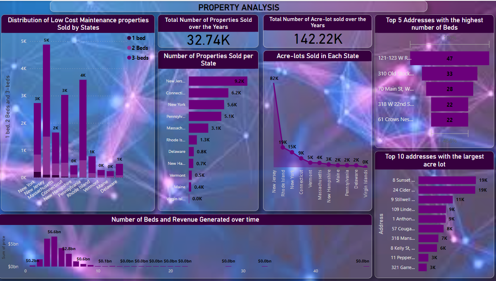

# Real-Estate-Sale-Analysis                                                                                       

## Introduction:

This is a Power BI project for a real estate financial growth report. The objectives is to analyze and derive an insights to address crucial questions such as sales and geographical location, as well as to facilitate data-driven decision-making.
___

## Problem Statement:

1.	Which areas are most likely experience a period of rapid growth in real estate prices due to their proximity to the sea?
2.	Which area exhibit the lowest property demand according to the data?
3.	Where are the highest concerntration of low-priced properties.
---
## Data Sourcing:

The data contains a single sheet/table:
The table has 23,2376 rows and 12 columns. The columns contain status, price, bed, bath, acre_lot, full_address, street, city, state, zip_code, house_size, and sold date.
___
## Skill/ Concept Demonstrated:

The following power BI features were used in the visualization:
-	Booking marking,
-	DAX, Quick measure,
-	Page navigation, 
-	Modelling,
-	Power query,
-	Filter,
-	Azure map visual.
___
## Modelling:

Automatic relationship was used and nothing was adjusted.
___
## Visualization

The report comprises of 6 pages:
1.	Real Estate Dashboard
2.	Price and Time series analysis
3.	Geographical analysis
4.	Property analysis
5.	Bedroom analysis
6.	Recommendations

You can interact with the report [here]( https://app.powerbi.com/groups/me/reports/0bb60621-b737-48af-8476-3d44e20c8724/ReportSection?experience=power-bi)
___
## Analysis

The Real Estate Dashboard consists of cards and 5 dashboards. Important elements to note on each page of the report include trends sales from year to year, geographical analysis, prices, types of properties and number of bedrooms.
___
### Geographical Analysis

This reveals the total number of properties in states and their locations and their proximity to the seaside. Areas like New Jersey have the highest rate of low-priced properties sold, with __9.2k__ as a result of its proximity to the seaside, followed by Connecticut with __6.2k__, and New York with __5.6k__. Mainwhile, other areas such as Vermont have __464__, Maine __373__, and the Virgin Islands have as low as __2__.
___
### Price and Time Series

This shows the areas with the highest prices and also reveal areas with properties of lowest values. It also illustrate the trend of sales, indicating a steady rise in property value between 1981 and peaking at 2021, amounting to __$1b__. 🤓
___
### Property Analysis

This shows the number of properties sold in each state, leaving New Jersey on top of the chart. This is due to its low-cost maintenance properties, totalling __4,875K__. This figure represent the sale of properties with the combination of properties with a combination of 1, 2, and 3 bedrooms.
___
### Bedroom Analysis

This shows a total 33k bedrooms. Majority of properties sold have between 1-5 beds. Although New York has the majority of properties with 1 bed, totalling __212__, New Jersey has more with 2 beds, __1,393__, and 3 bed __3,377__ properties respectively.
___
## RECOMMENDATIONS
The real estate data showed that there were 3 major Eras in the real estate sector.
-	Slow growth era and
-	The fast Growth Era
-	And the Housing estate Crash (2020-2023)
  
This Study will make recommendations based on the current affairs of the real Estate market using the given data:
1.	Bay areas such as Rhode Island and Delaware will most likely experience a period of rapid growth in the real estate prices due to their proximity to the sea and the relative low price  demand for their properties. These areas are good investment sites for future profit.
2.	Virgin Islands had the least property demand from the data. This may likely change in the near future as they share a border with the capital state of the country.
3.	New York, despite being one of the states with the highest demand over the period, is a business district and will continue to remain a hot cake for investors. investors are advised to take advantage of the low prices right now.
4.	New Jersey has the highest rate of low-priced properties, so for those who want to own a house without breaking the bank, they should consider making a trip to New Jersey.

I hope it's educative, Thank you for your time.😄

